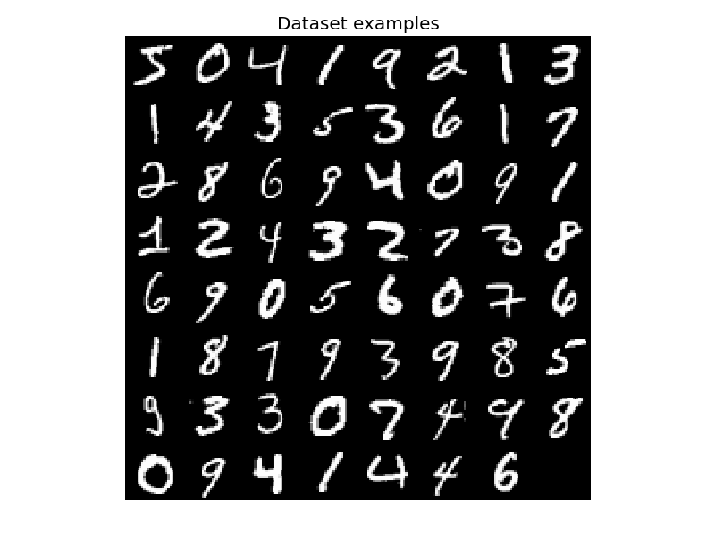
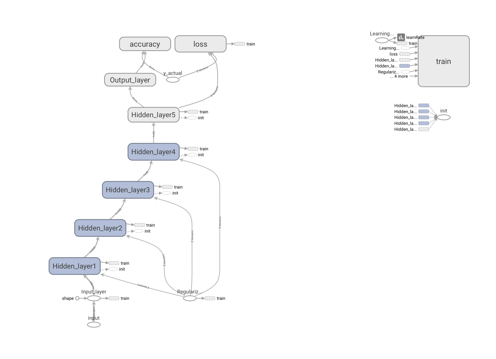
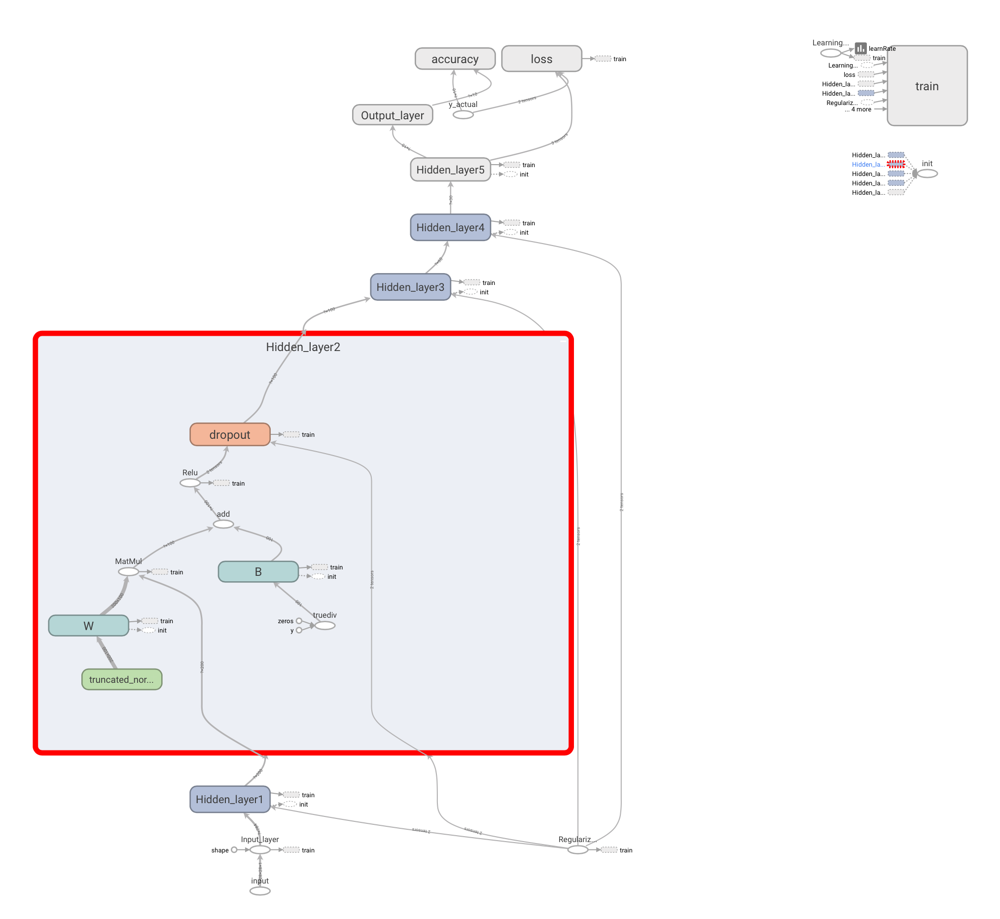
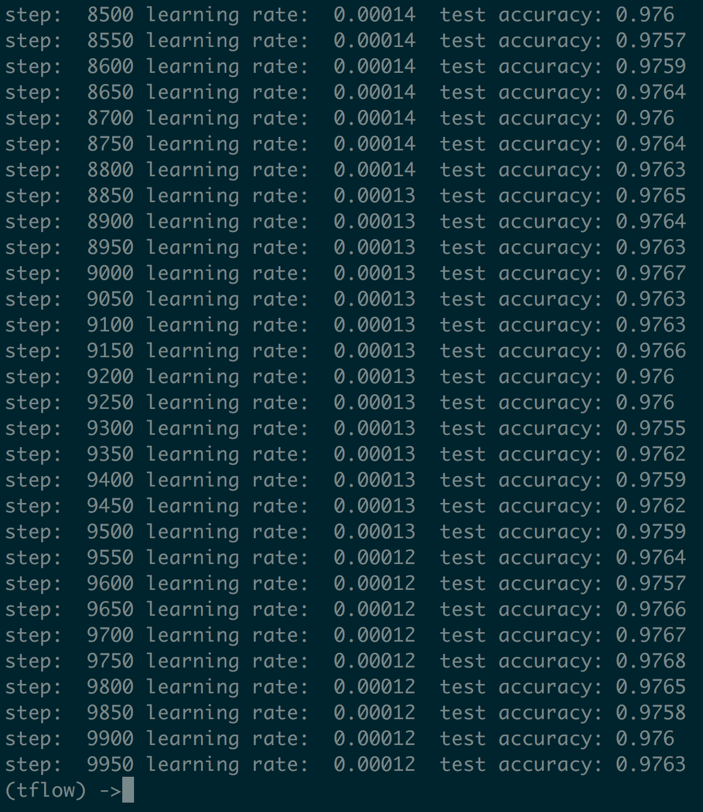

# Neural Net Classifier for Image classification using Tensorflow

#### Table of Content
1. [Usage](#usage)
2. [Dependency](#dependency)
3. [Input](#input)
4. [Model](#model)
5. [Decaying Learning Rate, Loss and Accuracy](#lossaccur)
6. [Conclusion](#conclusion)

## Usage <a name="usage"><a/>
- Downlaod nnet.py 
- Execute with `python nnet.py`.
  code will automatically download dataset
- Visualize with `tensorboard --logdir /tmp/tboard/nnet`

You can expect an accuracy of about `97% +` in test image.

That's It!

## Dependency <a name="dependency"><a/>
- tensorflow 1.4 (and tensorboard for visualization)
- developed and tested in python3.6
- you need to have write permission in /tmp (who doesn't)
  
## Input <a name="input"></a>

Following is the input dataset used as an example. It is MNIST dataset containing hand written digits.
The code utilized tensorflow inbuild modules to download the data in your working directory.
Input are of 28x28x1 dimension that is flattened out before using in the model. 
```python
nist = mnist_data.read_data_sets("data",one_hot=True, reshape=False, validation_size=0)
```


## The Model <a name="model"></a>

The model is a five layer Fully connected  Neural Network. Softmax is used as a last layer for converting scores into class probability.

Five layers seems to be an overkill for this problem, but it is mostly for demonestration purpose.
Following is the computational graph.



Zooming into one of the hidden layer helps understand the structure bettter (see below). Weights multiplied with the output of previous layer and biases are added. The resultant is then passed through ReLU activation funciton. 



## Decaying Learning Rate, Loss and Accuracy <a name="lossaccur"></a>

A decaying learning rate is used to converge faster. Note that when the learning rate was high, loss function was jumping around and as the learning rate started decreasing, loss function started to decrement in small steps and hence it became much smoother. 


## Conclusion <a name="conclusion"></a>

97% + test accuracy was achieved. 


